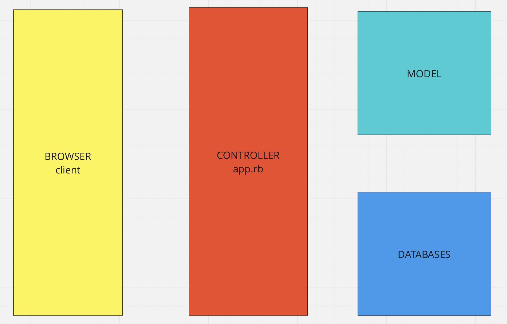
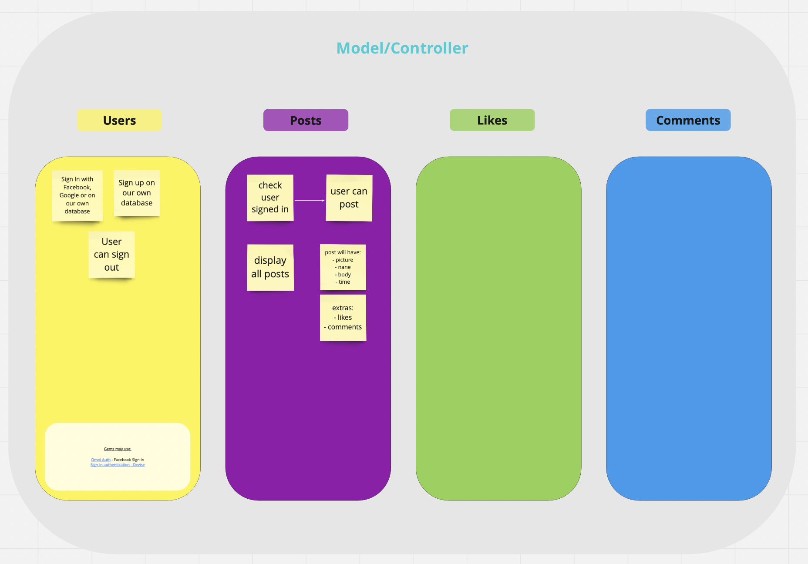
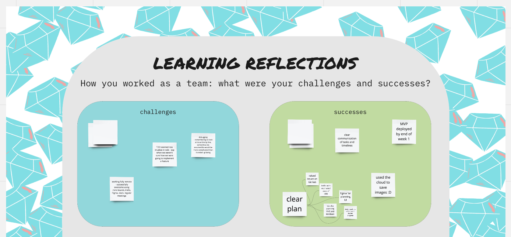
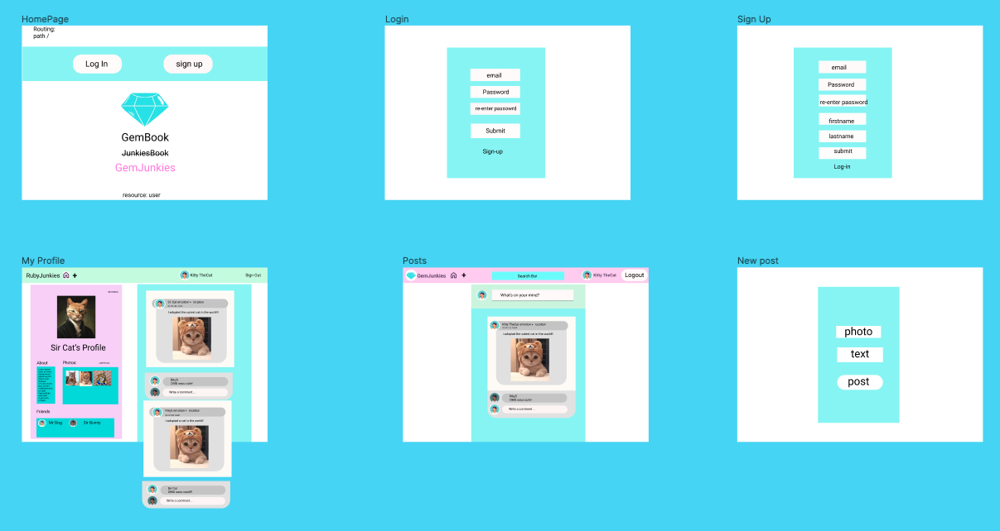

# GemJunkies (Facebook Clone)


## Quickstart

First, clone this repository. Then:

```bash
> bundle install
> bin/rails db:create
> bin/rails db:migrate

> bundle exec rspec # Run the tests to ensure it works
> bin/rails server # Start the server at localhost:3000
```

## Troubleshooting

If you don't have Node.js installed yet, you might run into this error when running rspec:

```
ExecJS::RuntimeUnavailable:
  Could not find a JavaScript runtime. See https://github.com/rails/execjs for a list of available runtimes.
 ```

Rails requires a Javascript runtime to work. The easiest way is to install Node by running `brew install node` - and then run `bundle exec rspec` again

## Meet the team:

This project was made by Team Ruby Junkies comprising of:

Riky Moroni
Giorgi Gutsaev
Chris Thomas
Sherwin Panganiban
Francesco Collotto
Jess Gordon

From Makers Cohort November 2021

## About

This is a facebook-clone application made by team Ruby Junkies for our weeks 8-9 Group Project. This application has multiple features, including the ability to:

Sign up
Sign in 
Sign up or in with Facebook, 
Create a profile (With an about) and update your Profile Picture
Create a post, text or Image
Comment on a post
Like a Post or Comment
Edit and Delete comments and Posts
Send a Friend Request
Accept or Decline a Friend Request
See your Friends on your profile
View your posts, comments and photos on your profile
Edit your Profile
See if someone is your friend on their profile
Give a post or comment a Gem
Profile shows your total Gem Count

This project is running on Heroku at http://gem-junkies.herokuapp.com - please feel free to head over and give it a try!

## Installation

To use, please download the files and run bundle install. This should install all the required gems. Please then run bin/rails db:migrate to create the databases, and then finally run bin/rails to run on your local machine at localhost:3000. Alternatively, visit http://gem-junkies.herokuapp.com - to view the full site!

## User Stories

As a user,
So that I can see what people are up to,
I would like to see posts in reverse chronological order

As a user,
So that I can personalize my experience with GemJunkies,
I would like to be able to sign up with my email address, name, and password.

As a user,
So that I can use my GemJunkies account,
I would like to be able to log in.

As a user,
So that no one else can post as me,
I would like to be able to log out.

As a user,
So that I can tell people what I’m up to,
I would like to be able to publish a post.

As a user,
So that I can see when a post was written,
I would like to be able to see the day and time it was published.

As a user,
So that I can interact with the GemJunkies community,
I would like to be able to like a post.

As a user,
So that my opinions can be heard,
I would like to be able to comment on a post.

As a user,
So that I can fix typos,
I would like to be able to edit my own post.

As a user,
So that I can erase embarrassing mistakes,
I would like to be able to delete any of my own posts.

As a user,
So that I can keep track of my friends’ lives,
I would like to be able to add friends.

As a user,
So that I can choose my friends,
I would like to be able to send a friend request.

As a user,
So that I don’t have to be friends with people I don’t know or like,
I would like to be able to refuse a friend request.

As a user,
So that I can be added by my friends,
I would like to be able to accept a friend request.

As a user,
So that I can see who wants to be my friend,
I would like to be able to see ‘pending friend requests’ that are waiting on my acceptance/refusal.

As a user,
So I can show my support,
I would like to be able to like a post or comment

As a user,
So I can see who likes my posts,
I would like to see a count of the amount of people who like my post and their names

As a user,
So I don’t like a post I’ve already liked,
I would like to see if I have liked a post

As a user,
So I can see how good my posts are,
I would like to be given Gems for my posts and be able to see my total number of Gems

As a user,
So I know when someone comments or sends me a friend request,
I would like to receive notifications when these happen

As a user,
So I can see all my posts and photos in one place,
I would like to have a profile page

As a user,
So I can change my profile picture and about,
I would like to be able to edit my profile

As a user,
To sign in more easily,
I would like to be able to sign in with Facebook

As a user,
To have a good experience,
I would like the site to look nice!

## Some Diagrams From Our Process:

### MIRO:






### FIGMA:


## Contributing

Pull requests are welcome. For major changes, please open an issue first to discuss what you would like to change.
Please make sure to update tests as appropriate.

